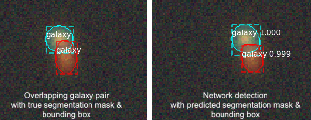

# galaxy_separation_mrcnn

Most observed astronomical objects have some overlap with neighboring objects. However, scientific measurements require isolated galaxy images. We explore the application Mask Region-based CNN ([Mask R-CNN](https://arxiv.org/abs/1703.06870)) to separate images of overlapping astronomical bodies ("deblending").

This repository is a research project work in progress.
This code uses the Python 3, Keras, and TensorFlow [implementation](https://github.com/matterport/Mask_RCNN) of Mask R-CNN to perform instance segmentation on images of overlapping galaxy pairs. The out-of-the-box implementation of MRCNN is optimized for performing images on the [MS COCO Dataset](http://cocodataset.org/#home). 

* ([model.py](mrcnn/model.py), [utils.py](mrcnn/utils.py), [config.py](mrcnn/config.py)): These files contain the main Mask RCNN implementation. 

* ([model.py](scripts/train.py) trains the network.

* ([model.py](scripts/evaluate.py) runs the network on validation set to test performance.

Our dataset image size is $120 times 120$, much smaller than the 800 $\times$ 800 for training the MS COCO dataset. Thus the RPN anchor sizes were reduced in proportion in order to be able to detect features with scales desired here.  

# Training Data

The network was trained on simulated overlapping galaxy images with varying degrees of overlap. The galaxies were simulated using WeakLensingDeblending Package as sersic bulge + disk profiles. Segmentation maps are regions with pixel values above a threshold value for each galaxy.

The trained network is able to detect individual galaxies in the overlapping pair images along with producing a segmentation mask and bounding box.

